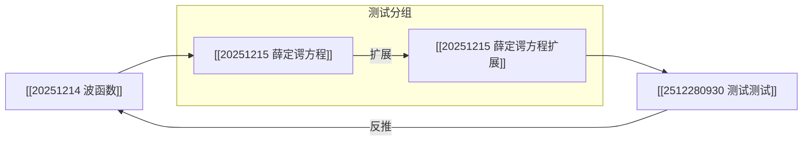

# Design Document: Mermaid Storage Format

## Overview

本设计文档描述了如何将 MOC（Map of Content）笔记的存储格式从自定义列表格式迁移到标准的 Mermaid 图表格式。新格式将提供更好的可读性和可维护性，同时保持所有现有功能（节点、边、分组、元数据）的完整性。

核心设计理念：
1. **标准化**：使用 Mermaid 的标准 graph LR 语法
2. **可读性**：生成的代码应该易于人工阅读和编辑
3. **完整性**：保留所有元数据信息（位置、分组、弧度、颜色）
4. **往返一致性**：parse → serialize → parse 应产生等效结果

## Architecture

### 整体架构

```
┌─────────────────┐
│   MOC File      │
│  (Mermaid)      │
└────────┬────────┘
         │
         ↓
┌─────────────────┐
│  MermaidParser  │  ← 解析 Mermaid 语法
└────────┬────────┘
         │
         ↓
┌─────────────────┐
│  MOCParseResult │  ← 内部数据结构
│  - nodes        │
│  - edges        │
│  - groups       │
│  - metadata     │
└────────┬────────┘
         │
         ↓
┌─────────────────┐
│MermaidSerializer│  ← 生成 Mermaid 语法
└────────┬────────┘
         │
         ↓
┌─────────────────┐
│   MOC File      │
│  (Mermaid)      │
└─────────────────┘
```

### 数据流

1. **读取流程**：
   - 读取 MOC 文件内容
   - 识别 Mermaid 代码块（```mermaid ... ```）
   - 解析节点定义、边定义、分组定义
   - 提取元数据注释
   - 构建 MOCParseResult

2. **写入流程**：
   - 接收 MOCParseResult
   - 生成节点定义
   - 生成分组定义（subgraph）
   - 生成边定义
   - 生成元数据注释
   - 写入文件

## Components and Interfaces

### 1. MermaidParser

负责解析 Mermaid 格式的 MOC 文件。

```typescript
interface MermaidParser {
    /**
     * 解析 Mermaid 格式的 MOC 文件
     * @param content - 文件内容
     * @returns 解析结果
     */
    parse(content: string): MOCParseResult;
    
    /**
     * 识别 Mermaid 代码块
     * @param content - 文件内容
     * @returns Mermaid 代码内容，如果不存在则返回 null
     */
    extractMermaidBlock(content: string): string | null;
    
    /**
     * 解析节点定义
     * @param line - Mermaid 代码行
     * @returns 节点信息，如果不是节点定义则返回 null
     */
    parseNode(line: string): NodeDefinition | null;
    
    /**
     * 解析边定义
     * @param line - Mermaid 代码行
     * @returns 边信息，如果不是边定义则返回 null
     */
    parseEdge(line: string): EdgeDefinition | null;
    
    /**
     * 解析分组定义
     * @param lines - Mermaid 代码行数组
     * @param startIndex - 开始索引
     * @returns 分组信息和结束索引
     */
    parseSubgraph(lines: string[], startIndex: number): {
        group: GroupInfo;
        endIndex: number;
    } | null;
    
    /**
     * 解析元数据注释
     * @param content - Mermaid 代码内容
     * @returns 元数据对象
     */
    parseMetadata(content: string): {
        nodePositions: Record<string, { x: number; y: number }>;
        groups: GroupInfo[];
        edgeCurvatures: Record<string, { distance: number; weight: number }>;
        nodeColors: Record<string, string>;
    };
}

interface NodeDefinition {
    id: string;              // 节点 ID，如 "a", "a.1"
    wikiLink: string;        // Wiki 链接，如 "20251214 波函数"
    displayText: string;     // 显示文本
}

interface EdgeDefinition {
    source: string;          // 源节点 ID
    target: string;          // 目标节点 ID
    label: string;           // 边标签（可选）
}
```

### 2. MermaidSerializer

负责将内部数据结构序列化为 Mermaid 格式。

```typescript
interface MermaidSerializer {
    /**
     * 序列化 MOC 数据为 Mermaid 格式
     * @param data - MOC 解析结果
     * @returns Mermaid 格式的字符串
     */
    serialize(data: MOCParseResult): string;
    
    /**
     * 生成节点定义
     * @param node - 节点信息
     * @returns Mermaid 节点定义字符串
     */
    serializeNode(node: MOCTreeNode): string;
    
    /**
     * 生成边定义
     * @param edge - 边信息
     * @returns Mermaid 边定义字符串
     */
    serializeEdge(edge: ReverseRelation): string;
    
    /**
     * 生成分组定义
     * @param group - 分组信息
     * @param nodes - 分组中的节点
     * @returns Mermaid subgraph 字符串
     */
    serializeSubgraph(group: GroupInfo, nodes: MOCTreeNode[]): string;
    
    /**
     * 生成元数据注释
     * @param data - MOC 解析结果
     * @returns 元数据注释字符串
     */
    serializeMetadata(data: MOCParseResult): string;
}
```

### 3. 更新现有的 parseMOCStructure 函数

```typescript
/**
 * 解析 MOC 笔记中指定标题下的树结构
 * 支持 Mermaid 格式
 */
export async function parseMOCStructure(
    app: App,
    filePath: string,
    headingTitle: string
): Promise<MOCParseResult> {
    const file = app.vault.getFileByPath(filePath);
    if (!file) {
        return emptyResult(filePath, headingTitle);
    }

    const content = await app.vault.read(file);
    
    // 使用 Mermaid 解析器
    const mermaidParser = new MermaidParser(app);
    return mermaidParser.parse(content);
}
```

### 4. 保存功能集成

```typescript
/**
 * 保存 MOC 数据到文件
 */
export async function saveMOCStructure(
    app: App,
    filePath: string,
    headingTitle: string,
    data: MOCParseResult
): Promise<void> {
    const file = app.vault.getFileByPath(filePath);
    if (!file) {
        throw new Error(`File not found: ${filePath}`);
    }

    const content = await app.vault.read(file);
    const serializer = new MermaidSerializer();
    const mermaidContent = serializer.serialize(data);
    
    // 替换指定标题下的内容
    const updatedContent = replaceHeadingContent(
        content,
        headingTitle,
        mermaidContent
    );
    
    await app.vault.modify(file, updatedContent);
}
```

## Data Models

### Mermaid 格式示例



### 格式规则

1. **节点定义**：
   - 格式：`nodeId["[[wikilink]]"]`
   - 示例：`a["[[20251214 波函数]]"]`
   - 节点 ID 必须唯一
   - Wiki 链接使用双方括号

2. **边定义**：
   - 无标签：`source --> target`
   - 有标签：`source -->|label| target`
   - 示例：`a.1 -->|扩展| a.1.a`

3. **分组定义**：
   - 使用 `subgraph` 块
   - 格式：`subgraph groupId [groupLabel]`
   - 包含 `direction TB`（从上到下）
   - 示例：
     ```mermaid
     subgraph group_1767414971883 [测试分组]
         direction TB
         a.1["[[20251215 薛定谔方程]]"]
         a.1.a["[[20251215 薛定谔方程扩展]]"]
     end
     ```

4. **元数据注释**：
   - 格式：`%% ext:{JSON} %%`
   - 包含：node_positions, groups, edge_curvatures, node_colors
   - 必须是有效的 JSON

5. **注释**：
   - 使用 `%%` 开头
   - 用于说明各部分的作用

### 解析策略

1. **节点解析**：
   - 正则表达式：`/^([a-zA-Z0-9.]+)\["?\[\[([^\]]+)\]\]"?\]$/`
   - 提取节点 ID 和 Wiki 链接
   - 验证节点 ID 格式（字母、数字、点号）

2. **边解析**：
   - 无标签：`/^([a-zA-Z0-9.]+)\s*-->\s*([a-zA-Z0-9.]+)$/`
   - 有标签：`/^([a-zA-Z0-9.]+)\s*-->\\|([^|]+)\\|\s*([a-zA-Z0-9.]+)$/`
   - 提取源节点、目标节点、标签

3. **分组解析**：
   - 识别 `subgraph` 开始
   - 提取分组 ID 和标签
   - 收集分组内的节点定义
   - 识别 `end` 结束

4. **元数据解析**：
   - 查找 `%% ext:{...} %%` 模式
   - 解析 JSON 内容
   - 验证 JSON 格式

## Correctness Properties

*属性（Property）是关于系统行为的形式化陈述，应该在所有有效执行中保持为真。属性是人类可读规范和机器可验证正确性保证之间的桥梁。*

### Property 1: Mermaid 代码块识别

*对于任何* 包含 \`\`\`mermaid 代码块的文件内容，解析器应该能够正确提取代码块内容

**Validates: Requirements 1.1**

### Property 2: 完整元素解析

*对于任何* 有效的 Mermaid 图表，解析器应该提取所有节点、边、分组和元数据，且提取的元素数量与原始定义一致

**Validates: Requirements 1.2, 1.3, 1.4, 1.5**

### Property 3: 错误处理

*对于任何* 包含语法错误的 Mermaid 代码，解析器应该返回包含错误位置和描述的错误信息

**Validates: Requirements 1.6**

### Property 4: 有效 Mermaid 语法生成

*对于任何* 有效的 MOCParseResult，序列化器生成的 Mermaid 代码应该符合 Mermaid graph LR 语法规范

**Validates: Requirements 2.1**

### Property 5: 正确格式序列化

*对于任何* MOCParseResult 中的节点、边和分组，序列化器应该使用正确的 Mermaid 格式（节点：nodeId["[[link]]"]，边：source -->|label| target，分组：subgraph）

**Validates: Requirements 2.2, 2.3, 2.4**

### Property 6: 元数据保留

*对于任何* 包含元数据的 MOCParseResult，序列化器应该在注释中保存所有 node_positions、groups、edge_curvatures 和 node_colors 信息

**Validates: Requirements 2.5**

### Property 7: 节点 ID 验证

*对于任何* 解析的 Mermaid 图表，系统应该验证所有节点都有非空且唯一的 ID

**Validates: Requirements 3.1**

### Property 8: 边引用验证

*对于任何* 解析的边定义，系统应该验证源节点和目标节点都在节点列表中存在

**Validates: Requirements 3.2**

### Property 9: 分组引用验证

*对于任何* 解析的分组定义，系统应该验证分组中的所有节点 ID 都在节点列表中存在

**Validates: Requirements 3.3**

### Property 10: 关系完整性

*对于任何* MOCParseResult，序列化后的 Mermaid 代码应该包含所有节点之间的关系（父子关系和箭头关系）

**Validates: Requirements 3.4**

### Property 11: 往返一致性（Round-trip）

*对于任何* 有效的 MOCParseResult，执行 serialize → parse 应该产生等效的数据结构（节点、边、分组、元数据相同）

**Validates: Requirements 3.5**

### Property 12: 模板有效性

*当* 生成新 MOC 模板时，模板内容应该是有效的 Mermaid 语法且可以被解析器正确解析

**Validates: Requirements 4.1**

### Property 13: 自动序列化

*对于任何* 保存操作，系统应该自动将 MOCParseResult 序列化为 Mermaid 格式并写入文件

**Validates: Requirements 4.2**

## Error Handling

### 解析错误

1. **代码块未找到**：
   - 错误：文件中没有 Mermaid 代码块
   - 处理：返回空的 MOCParseResult

2. **语法错误**：
   - 错误：节点定义格式不正确
   - 处理：记录错误行号和内容，继续解析其他行

3. **引用错误**：
   - 错误：边引用不存在的节点
   - 处理：记录警告，跳过该边

4. **元数据错误**：
   - 错误：元数据 JSON 格式不正确
   - 处理：记录警告，使用空元数据

### 序列化错误

1. **无效数据**：
   - 错误：MOCParseResult 包含无效节点
   - 处理：抛出异常，阻止保存

2. **文件写入错误**：
   - 错误：无法写入文件
   - 处理：显示错误通知，保留原文件

### 错误报告格式

```typescript
interface ParseError {
    type: 'syntax' | 'reference' | 'metadata';
    line: number;
    message: string;
    context: string;  // 错误行的内容
}

interface ParseResult {
    success: boolean;
    data: MOCParseResult | null;
    errors: ParseError[];
    warnings: ParseError[];
}
```

## Testing Strategy

### 单元测试和属性测试

本项目使用双重测试策略：
- **单元测试**：验证特定示例、边缘情况和错误条件
- **属性测试**：验证通用属性在所有输入下都成立

两种测试方法是互补的，共同提供全面的测试覆盖。

### 单元测试

单元测试用于验证特定示例和边缘情况：

1. **解析器测试**：
   - 测试空文件
   - 测试只有节点的图表
   - 测试只有边的图表
   - 测试包含分组的图表
   - 测试包含元数据的图表
   - 测试各种语法错误

2. **序列化器测试**：
   - 测试空数据结构
   - 测试单个节点
   - 测试简单树结构
   - 测试包含分组的结构
   - 测试包含元数据的结构

3. **集成测试**：
   - 测试完整的读取-保存流程
   - 测试 UI 通知显示
   - 测试错误处理

### 属性测试

属性测试用于验证通用属性在所有输入下都成立。

**配置**：每个属性测试运行 100 次迭代（由于随机化）

**测试框架**：使用 fast-check 进行属性测试

1. **Property 1: Mermaid 代码块识别**
   - 生成：随机文件内容，包含或不包含 Mermaid 代码块
   - 验证：extractMermaidBlock 正确识别
   - 标签：**Feature: mermaid-storage-format, Property 1: Mermaid 代码块识别**

2. **Property 2: 完整元素解析**
   - 生成：随机的有效 Mermaid 图表
   - 验证：解析后的节点、边、分组数量正确
   - 标签：**Feature: mermaid-storage-format, Property 2: 完整元素解析**

3. **Property 3: 错误处理**
   - 生成：包含各种语法错误的 Mermaid 代码
   - 验证：返回适当的错误信息
   - 标签：**Feature: mermaid-storage-format, Property 3: 错误处理**

4. **Property 4: 有效 Mermaid 语法生成**
   - 生成：随机的 MOCParseResult
   - 验证：序列化后的代码符合 Mermaid 语法
   - 标签：**Feature: mermaid-storage-format, Property 4: 有效 Mermaid 语法生成**

5. **Property 5: 正确格式序列化**
   - 生成：随机的节点、边、分组
   - 验证：序列化后的格式正确
   - 标签：**Feature: mermaid-storage-format, Property 5: 正确格式序列化**

6. **Property 6: 元数据保留**
   - 生成：包含随机元数据的 MOCParseResult
   - 验证：序列化后元数据完整
   - 标签：**Feature: mermaid-storage-format, Property 6: 元数据保留**

7. **Property 7: 节点 ID 验证**
   - 生成：包含重复或空 ID 的图表
   - 验证：验证逻辑正确检测
   - 标签：**Feature: mermaid-storage-format, Property 7: 节点 ID 验证**

8. **Property 8: 边引用验证**
   - 生成：引用不存在节点的边
   - 验证：验证逻辑正确检测
   - 标签：**Feature: mermaid-storage-format, Property 8: 边引用验证**

9. **Property 9: 分组引用验证**
   - 生成：包含不存在节点的分组
   - 验证：验证逻辑正确检测
   - 标签：**Feature: mermaid-storage-format, Property 9: 分组引用验证**

10. **Property 10: 关系完整性**
    - 生成：随机的节点关系
    - 验证：序列化后所有关系都存在
    - 标签：**Feature: mermaid-storage-format, Property 10: 关系完整性**

11. **Property 11: 往返一致性（Round-trip）**
    - 生成：随机的 MOCParseResult
    - 验证：serialize → parse 产生等效结果
    - 标签：**Feature: mermaid-storage-format, Property 11: 往返一致性**

12. **Property 12: 模板有效性**
    - 生成：新 MOC 模板
    - 验证：模板可以被解析
    - 标签：**Feature: mermaid-storage-format, Property 12: 模板有效性**

13. **Property 13: 自动序列化**
    - 生成：随机的保存操作
    - 验证：文件内容是 Mermaid 格式
    - 标签：**Feature: mermaid-storage-format, Property 13: 自动序列化**

### 测试框架示例

使用 TypeScript 的属性测试库（fast-check）：

```typescript
import fc from 'fast-check';

// 示例：往返一致性测试
describe('Property 11: Round-trip consistency', () => {
    it('should preserve data structure after serialize → parse', () => {
        fc.assert(
            fc.property(
                arbitraryMOCParseResult(),
                (original) => {
                    const serializer = new MermaidSerializer();
                    const parser = new MermaidParser(app);
                    
                    const serialized = serializer.serialize(original);
                    const parsed = parser.parse(serialized);
                    
                    // 验证等效性
                    expect(parsed.nodes).toEqual(original.nodes);
                    expect(parsed.reverseRelations).toEqual(original.reverseRelations);
                    expect(parsed.groups).toEqual(original.groups);
                    expect(parsed.nodePositions).toEqual(original.nodePositions);
                }
            ),
            { numRuns: 100 }
        );
    });
});
```

### 性能测试

1. **解析性能**：
   - 创建包含 100+ 节点的 Mermaid 文件
   - 测量解析时间
   - 验证 < 500ms

2. **序列化性能**：
   - 创建包含 100+ 节点的数据结构
   - 测量序列化时间
   - 验证 < 300ms

3. **缓存效果**：
   - 多次解析同一文件
   - 验证第二次更快
