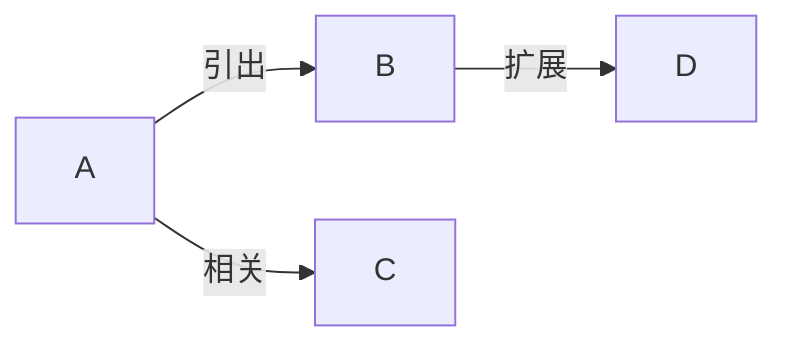

# MOC 关系文本显示功能

## 功能描述

在 MOC 模式下，连接线上现在会显示节点的 `relationText`（关系文本），例如"引出"、"相关"、"扩展"等，让思维导图的关系更加清晰。

## 实现效果

### 之前的行为

```
节点A --> 节点B
节点A --> 节点C
```

连接线上没有任何文字，无法看出节点之间的具体关系。

### 现在的行为

```
节点A -->|引出| 节点B
节点A -->|相关| 节点C
节点A -->|扩展| 节点D
```

连接线上显示关系文本，清晰表达节点之间的关系类型。

## MOC 文件格式

### 标准格式

```markdown
# 思维树

- 引出 [[20251214-波函数]] `a`
  - 引出 [[20251215-薛定谔方程]] `a.1`
    - 扩展 [[20251215-薛定谔方程扩展]] `a.1.a`
  - 相关 [[20251220-概率诠释]] `a.2`
```

### 解析规则

1. **关系文本**: wiki 链接前的文字（如"引出"、"相关"、"扩展"）
2. **wiki 链接**: `[[文件名]]` 或 `[[文件名|显示文本]]`
3. **节点 ID**: 反引号中的标识符（如 `` `a` ``、`` `a.1` ``）

### 示例

| MOC 行 | 关系文本 | wiki 链接 | 节点 ID |
|--------|---------|-----------|---------|
| `- 引出 [[波函数]] \`a\`` | "引出" | "波函数" | "a" |
| `- 相关 [[概率诠释]] \`a.2\`` | "相关" | "概率诠释" | "a.2" |
| `- [[薛定谔方程]] \`a.1\`` | "" (空) | "薛定谔方程" | "a.1" |

## 技术实现

### 1. 解析关系文本

在 `src/utils/utils.ts` 的 `parseMOCItem()` 方法中：

```typescript
// 获取关系描述（wiki链接前的文字）
const beforeLink = content.substring(0, content.indexOf('[[')).trim();
const relationText = beforeLink || '';

return {
    nodeID,
    wikiLink,
    displayText: linkDisplayText,
    file,
    relationText,  // 保存关系文本
};
```

### 2. 传递关系文本

在 `convertMOCToZKNodes()` 方法中，将 `relationText` 传递给 ZKNode：

```typescript
const zkNode: ZKNode = {
    ID: mocNode.nodeID || mocNode.wikiLink,
    IDArr: nodeIDArr,
    IDStr: mocNode.nodeID || nodeIDArr.join(','),
    position: position++,
    file: mocNode.file,
    title: mocNode.displayText,
    relationText: mocNode.relationText,  // 传递关系文本
    displayText: getDisplayText(plugin, mocNode),
    ctime: mocNode.file.stat?.ctime || Date.now(),
    // ...
};
```

### 3. 在 Mermaid 图中显示

在 `generateFlowchartStr()` 方法中：

```typescript
for (let son of sonNodes) {
    // 如果子节点有 relationText，在连接线上显示
    if (son.relationText && son.relationText.trim() !== '') {
        // 转义 relationText 中的特殊字符
        const escapedRelation = this.escapeMermaidText(son.relationText);
        mermaidStr = mermaidStr + `${node.position} -->|${escapedRelation}| ${son.position};\n`;
    } else {
        // 没有 relationText 时使用普通连接线
        mermaidStr = mermaidStr + `${node.position} --> ${son.position};\n`;
    }
}
```

### 4. Mermaid 语法

Mermaid 支持在连接线上显示文本：



渲染效果：
- A 到 B 的连接线上显示"引出"
- A 到 C 的连接线上显示"相关"
- B 到 D 的连接线上显示"扩展"

### 5. 特殊字符转义

使用 `escapeMermaidText()` 方法转义特殊字符：

```typescript
escapeMermaidText(text: string): string {
    return text.replace(/`([^`]+)`/g, '$1')
        .replace(/"/g, '&quot;')
        .replace(/\n/g, ' ');
}
```

这样可以避免 Mermaid 解析错误。

## 使用示例

### 示例 1: 基础关系

**MOC 文件**:
```markdown
# 思维树

- 引出 [[波函数]] `a`
  - 引出 [[薛定谔方程]] `a.1`
  - 相关 [[概率诠释]] `a.2`
```

**渲染效果**:
```
波函数 -->|引出| 薛定谔方程
波函数 -->|相关| 概率诠释
```

### 示例 2: 复杂关系

**MOC 文件**:
```markdown
# 量子力学

- 基础 [[波函数]] `a`
  - 引出 [[薛定谔方程]] `a.1`
    - 扩展 [[薛定谔方程扩展]] `a.1.a`
    - 应用 [[量子谐振子]] `a.1.b`
  - 相关 [[概率诠释]] `a.2`
    - 补充 [[波恩规则]] `a.2.a`
```

**渲染效果**:
```
波函数 -->|引出| 薛定谔方程
薛定谔方程 -->|扩展| 薛定谔方程扩展
薛定谔方程 -->|应用| 量子谐振子
波函数 -->|相关| 概率诠释
概率诠释 -->|补充| 波恩规则
```

### 示例 3: 无关系文本

**MOC 文件**:
```markdown
# 思维树

- [[波函数]] `a`
  - [[薛定谔方程]] `a.1`
```

**渲染效果**:
```
波函数 --> 薛定谔方程
```

没有关系文本时，使用普通连接线（无标签）。

## 视觉效果

### 连接线样式

- **有关系文本**: `A -->|关系| B`
  - 连接线中间显示关系文本
  - 文字背景为白色（或主题背景色）
  - 文字大小：12px（Mermaid 默认）

- **无关系文本**: `A --> B`
  - 普通连接线
  - 无标签

### 文字位置

- 关系文本显示在连接线的中间位置
- 自动调整位置避免重叠
- 支持多行文本（自动换行）

## 兼容性

### ID 分隔符

代码自动检测 ID 分隔符：

```typescript
// MOC 节点使用逗号分隔，普通节点可能使用点分隔
const separator = node.IDStr.includes(',') ? ',' : '.';
```

支持：
- MOC 模式：`a,a.1,a.1.a` (逗号分隔)
- 普通模式：`a.a.1.a.1.a` (点分隔)

### 向后兼容

- 如果 MOC 文件中没有关系文本，连接线显示为普通样式
- 不影响现有的 MOC 文件
- 可以逐步添加关系文本

## 最佳实践

### 1. 关系文本命名

建议使用简短、清晰的关系词：

**推荐**:
- 引出、相关、扩展、应用、补充
- 定义、解释、证明、推导
- 前提、结论、例子、反例

**不推荐**:
- 过长的句子："这个概念引出了下面的内容"
- 模糊的词语："有关"、"关于"
- 重复的词语：每个连接都用"引出"

### 2. 关系层次

不同层级可以使用不同的关系词：

```markdown
- 基础 [[概念A]] `a`
  - 引出 [[概念B]] `a.1`
    - 扩展 [[概念C]] `a.1.a`
      - 应用 [[案例D]] `a.1.a.1`
```

### 3. 一致性

在同一个 MOC 文件中保持关系词的一致性：

```markdown
# 好的示例
- 引出 [[A]] `a`
  - 引出 [[B]] `a.1`
  - 引出 [[C]] `a.2`

# 不好的示例
- 引出 [[A]] `a`
  - 导出 [[B]] `a.1`  # 应该用"引出"
  - 产生 [[C]] `a.2`  # 应该用"引出"
```

## 未来改进

### 1. 关系类型预设

在设置中添加常用关系词列表：

```typescript
interface ZKNavigationSettings {
    mocRelationTypes: string[];  // ["引出", "相关", "扩展", ...]
}
```

### 2. 关系文本自动补全

在编辑 MOC 文件时，提供关系词的自动补全：

```
- [输入关系词] [[文件名]] `id`
  ↓ 自动补全
- 引出 [[文件名]] `id`
```

### 3. 关系类型样式

不同的关系类型使用不同的连接线样式：

```typescript
// 引出：实线
A -->|引出| B

// 相关：虚线
A -.->|相关| B

// 扩展：粗线
A ==>|扩展| B
```

### 4. 关系文本编辑

在图形界面中直接编辑关系文本：

- 右键点击连接线
- 选择"编辑关系"
- 输入新的关系文本
- 自动更新 MOC 文件

## 调试

### 查看关系文本

在控制台中查看节点的关系文本：

```javascript
// 查看所有节点的关系文本
console.log(mocNodes.map(n => ({
    id: n.ID,
    relation: n.relationText,
    file: n.file.basename
})));
```

### 常见问题

1. **关系文本不显示**
   - 检查 MOC 文件格式是否正确
   - 确保关系文本在 wiki 链接之前
   - 检查是否有特殊字符需要转义

2. **连接线重叠**
   - 调整节点布局方向
   - 使用更短的关系文本
   - 增加节点间距

3. **中文显示问题**
   - 确保文件编码为 UTF-8
   - 检查 Mermaid 主题设置
   - 更新 Obsidian 到最新版本

## 总结

✅ **已实现**: MOC 关系文本显示功能
✅ **编译成功**: 无错误
✅ **功能完整**: 
- 自动解析关系文本
- 在连接线上显示
- 支持特殊字符转义
- 兼容新旧格式

✅ **用户体验**:
- 关系更清晰
- 思维导图更易读
- 支持多种关系类型
- 向后兼容

现在你的 MOC 思维导图可以显示节点之间的关系了，就像你图片中展示的"引出"、"相关"等标签！
