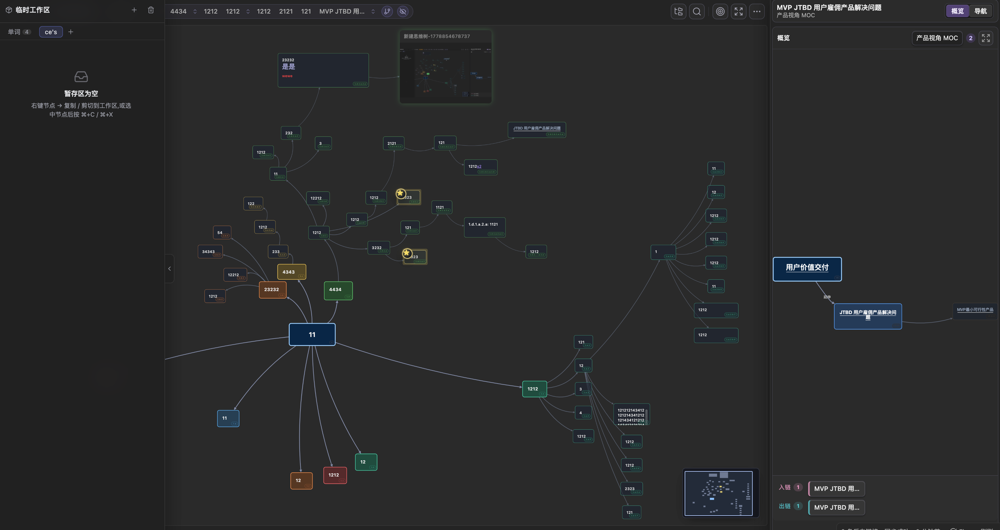
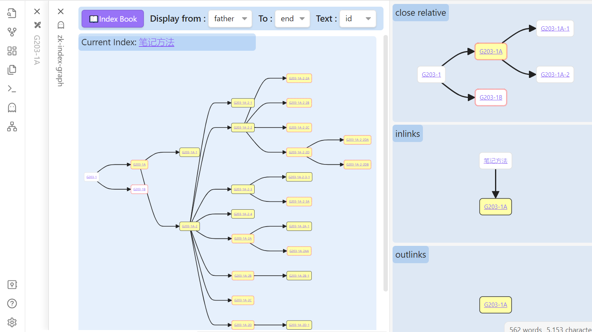
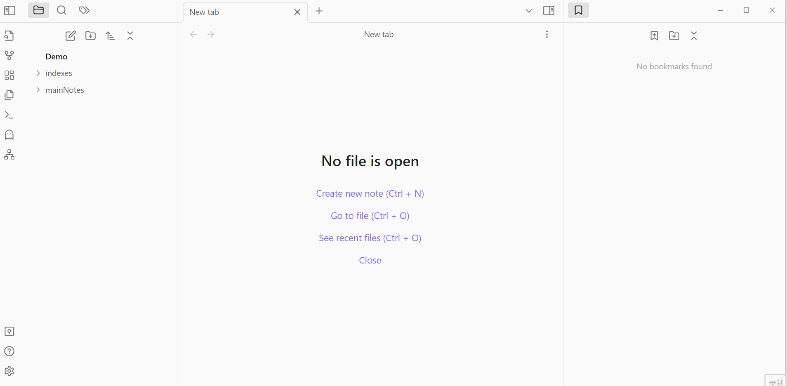

# Thought Navigator

Thought Navigator 是一个用于 Obsidian 的可视化思维树插件，适合卡片盒笔记法、MOC（Map of Content）工作流、主题研究和长期知识导航。



## 功能特性

- 基于 `.moc` 文件构建可视化思维树。
- 在图上直接创建、编辑、拖拽、连接、分组和着色节点。
- 支持自由布局和自动布局两种模式。
- 支持局部关系图，用于查看父节点、同级节点、子节点、入链和出链。
- 支持不同 MOC 文件之间的跨领域关联。
- 支持临时工作区，可在多个 MOC 之间复制、剪切和移动节点。
- 支持 Project Space 抽屉，用虚拟文件夹组织 MOC，不改变真实文件夹结构。
- 支持树内搜索，并可在思维树中定位当前笔记。
- 支持直接粘贴图片到图中，生成嵌入节点。
- 支持在 Markdown 阅读模式中显示 MOC 嵌入预览图。
- 支持主题模式、主题风格、连线样式、节点文字和布局选项。
- 支持 Obsidian URI，用链接打开指定图视图。

## 演示





## 核心概念

Thought Navigator 推荐使用 MOC 模式。MOC 文件是一个 `.moc` 文件，用来保存一棵可视化思维树，包括节点、关系、分组、布局状态和显示元数据。

插件主要有两个视图：

- **思维树视图**：主要工作区，用来编辑和导航一棵 MOC 思维树。
- **局部关系视图**：辅助视图，用来查看当前笔记附近的树状关系、入链和出链。

## 快速开始

1. 在 Obsidian 中安装并启用 Thought Navigator。
2. 执行命令 `New MOC file`，或在文件夹右键菜单中选择 `New MOC file`。
3. 打开生成的 `.moc` 文件。
4. 在思维树视图中添加节点、连接笔记、拖拽布局、创建分组和整理知识结构。
5. 需要查看当前笔记上下文时，执行 `Open local graph` 打开局部关系视图。

## 命令

| 命令 | 说明 |
| --- | --- |
| `Open tree graph` | 打开主思维树视图。 |
| `Open local graph` | 打开局部关系视图。 |
| `Reveal current file in tree graph` | 在思维树中定位当前文件。 |
| `New MOC file` | 创建新的 `.moc` 思维树文件。 |
| `添加当前 MOC 到项目文件夹` | 将当前 MOC 挂载到 Project Space 文件夹。 |

## 推荐工作流

1. 为一个主题、项目或研究方向创建一个 MOC。
2. 先搭建一级、二级结构，再逐步补充细节。
3. 新增笔记时，至少把它连接到一个已有想法。
4. 使用分组和颜色标记主题、阶段、模块或知识簇。
5. 当一个节点属于另一个主题时，使用跨领域链接连接到其他 MOC。
6. 使用局部关系视图复盘单张笔记在知识网络中的上下文。

## 节点编辑

在思维树视图中，你可以：

- 新增子节点、同级节点、父节点和自由节点。
- 编辑节点 ID 和标题。
- 拖拽节点，并自动保存位置。
- 创建有方向的节点关系。
- 编辑关系标签和连线样式。
- 对选中节点创建分组。
- 重命名、调整大小、改色或删除分组。
- 批量删除节点或批量修改颜色。
- 复制或剪切节点到临时工作区。
- 将临时工作区中的节点粘贴到另一个 MOC。
- 从剪贴板直接粘贴图片到思维树。

## 局部关系图

局部关系视图可以显示：

- 父节点、同级节点、子节点。
- 入链。
- 出链。
- 入链和出链的合并图。

你可以在插件设置中配置文件类型过滤、图方向和显示行为。

## Project Spaces

Project Spaces 是插件内部维护的虚拟文件夹系统。它可以用来组织 MOC 文件，但不会改变你的 Obsidian 仓库真实文件夹结构。

你可以：

- 创建 Space 和文件夹。
- 挂载或取消挂载 MOC。
- 在虚拟文件夹之间移动 MOC。
- 当 MOC 文件重命名或删除时，自动更新相关引用。

## 设置建议

新用户可以从下面的配置开始：

| 设置项 | 推荐值 |
| --- | --- |
| Theme mode | `auto` |
| Theme style | `modern` |
| Edge style | `bezier` |
| Node layout style | 手动整理用 `free`，结构化整理用 `auto` |
| Show note ID in branch view | 开启 |
| Text display mode | `id-title` |

## 隐私与数据访问

Thought Navigator 在 Obsidian 本地运行。

- 不收集遥测数据。
- 不会把你的笔记或图谱数据发送到远程服务器。
- 不需要账号。
- 不展示广告。
- 会读取仓库中的笔记、链接、元数据和 `.moc` 文件，用于生成图视图。
- 在你使用相关功能时，会写入 `.moc` 文件、插件设置、Project Space 数据，以及生成的预览图或附件文件。
- 当你明确使用新建 MOC、编辑图节点、粘贴图片、从图中删除嵌入文件等功能时，插件可能会创建、修改或移除仓库内文件。

## 安装

### 从 Obsidian 社区插件市场安装

插件通过社区市场审核后：

1. 打开 Obsidian 设置。
2. 进入 Community plugins。
3. 搜索 `Thought Navigator`。
4. 安装并启用插件。

### 手动安装

1. 下载 release 附件：
   - `main.js`
   - `manifest.json`
   - `styles.css`
2. 在你的 vault 中创建目录：

```text
.obsidian/plugins/thought-navigator/
```

3. 将下载的文件放入该目录。
4. 重启 Obsidian，并启用 Thought Navigator。

## 开发

安装依赖：

```bash
npm install
```

启动开发构建：

```bash
npm run dev
```

生成生产构建：

```bash
npm run build
```

当前仓库没有单独的自动化测试脚本。发布前请运行 `npm run build`，并在 Obsidian 中手动验证主要视图、MOC 创建、节点编辑、图导航、设置项和嵌入预览。

## 发布说明

发布 Obsidian 社区插件时，GitHub release tag 必须和 `manifest.json` 中的版本号一致。

release 必须包含：

- `main.js`
- `manifest.json`
- `styles.css`

当前插件元数据：

- 插件 ID：`thought-navigator`
- 显示名称：`Thought Navigator`
- 最低 Obsidian 版本：`1.8.5`

## 许可证

PolyForm Noncommercial License 1.0.0。见 [LICENSE](LICENSE)。

未经版权持有人另行授权，不允许商业使用。
如需商业授权，请联系：gutsfire@outlook.com。
