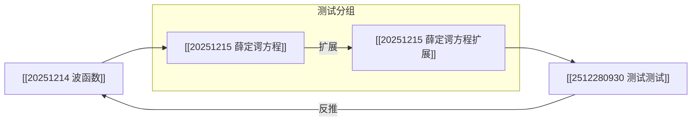
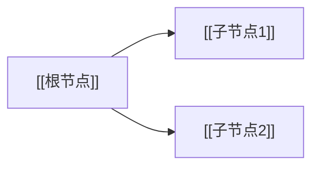
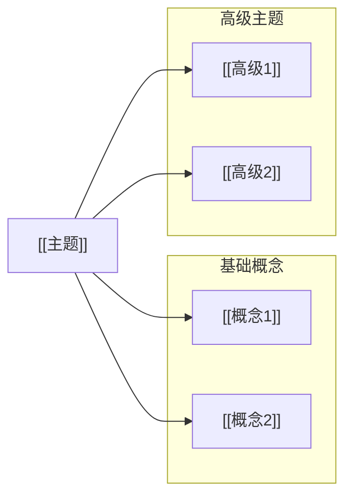
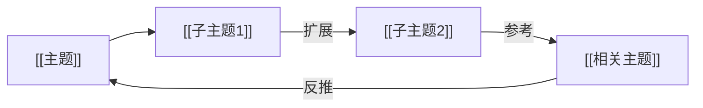

# Mermaid 格式 MOC 使用指南

## 概述

MOC（Map of Content）现在支持使用标准的 Mermaid 图表格式来组织笔记结构。Mermaid 格式提供了更好的可读性和可维护性，同时保持了所有现有功能。

## 基本格式

### 完整示例



## 语法规则

### 1. 节点定义

**格式**：`nodeId["[[wikilink]]"]`

**示例**：
```mermaid
a["[[20251214 波函数]]"]
a.1["[[20251215 薛定谔方程]]"]
a.1.a["[[20251215 薛定谔方程扩展]]"]
```

**规则**：
- 节点 ID 使用字母、数字和点号
- 点号表示层级关系（如 `a.1` 是 `a` 的子节点）
- Wiki 链接使用双方括号 `[[]]`
- 整个节点定义用方括号和引号包裹

### 2. 边定义

**无标签格式**：`source --> target`

**有标签格式**：`source -->|label| target`

**示例**：
```mermaid
a --> a.1                    %% 父子关系
a.1 -->|扩展| a.1.a          %% 带标签的关系
a.1.a.1 -->|反推| a          %% 反向关系
```

**规则**：
- 使用 `-->` 表示有向边
- 标签用竖线 `|` 包裹
- 父子关系通常不需要标签
- 其他关系建议添加标签说明

### 3. 分组定义

**格式**：
```mermaid
subgraph groupId [groupLabel]
    direction TB
    node1["[[link1]]"]
    node2["[[link2]]"]
end
```

**示例**：
```mermaid
subgraph group_physics [物理学基础]
    direction TB
    a.1["[[薛定谔方程]]"]
    a.2["[[波函数]]"]
end
```

**规则**：
- 使用 `subgraph` 关键字
- 分组 ID 必须唯一
- 分组标签用方括号包裹
- `direction TB` 表示从上到下布局
- 用 `end` 结束分组

### 4. 元数据注释

**格式**：`%% ext:{JSON} %%`

**包含内容**：
- `node_positions`: 节点位置信息
- `groups`: 分组信息
- `edge_curvatures`: 边弧度信息
- `node_colors`: 节点颜色信息

**示例**：
```mermaid
%% ext:{"node_positions":{"a":{"x":620.17,"y":329.44}},"groups":[],"edge_curvatures":{},"node_colors":{}} %%
```

**规则**：
- 必须是有效的 JSON 格式
- 系统会自动更新这部分内容
- 手动编辑时要小心保持 JSON 格式正确

### 5. 注释

**格式**：`%% 注释内容 %%`

**示例**：
```mermaid
%% 1. 定义根节点
%% 这是一个注释
```

**规则**：
- 使用 `%%` 开头和结尾
- 可以用于说明各部分的作用
- 不会影响图形渲染

## 创建新 MOC

### 方法 1：使用模板

1. 创建新的 Markdown 文件
2. 添加一级标题（如 `# 思维树`）
3. 在标题下添加 Mermaid 代码块
4. 使用模板内容：

```markdown
# 思维树

\`\`\`mermaid
graph LR

%% 1. 定义根节点
a["[[示例笔记 A]]"]

%% 2. 定义子节点
a.1["[[示例笔记 A.1]]"]
a.2["[[示例笔记 A.2]]"]

%% 3. 定义连线关系
a --> a.1
a --> a.2

%% ext:{"node_positions":{},"groups":[],"edge_curvatures":{},"node_colors":{}} %%
\`\`\`
```

### 方法 2：手动创建

1. 创建 Mermaid 代码块
2. 定义节点（从根节点开始）
3. 定义边（建立节点关系）
4. 添加元数据注释行

## 编辑 MOC

### 添加节点

1. 在 Mermaid 代码中添加节点定义
2. 添加相应的边定义
3. 保存文件
4. 刷新视图

**示例**：
```mermaid
%% 添加新节点
a.3["[[新笔记]]"]

%% 添加边
a --> a.3
```

### 添加分组

1. 使用 `subgraph` 块包裹相关节点
2. 给分组一个唯一的 ID 和标签
3. 保存文件

**示例**：
```mermaid
subgraph group_new [新分组]
    direction TB
    a.1["[[笔记1]]"]
    a.2["[[笔记2]]"]
end
```

### 添加关系标签

1. 在边定义中添加标签
2. 使用竖线包裹标签文本

**示例**：
```mermaid
a.1 -->|引出| a.2
a.2 -->|相关| a.3
```

## 自动功能

### 位置保存

- 拖动节点后，位置会自动保存到 `node_positions`
- 无需手动编辑元数据

### 分组管理

- 在图形界面中创建分组
- 分组信息会自动保存到 `groups`

### 边弧度

- 拖动边的控制点调整弧度
- 弧度信息会自动保存到 `edge_curvatures`

## 最佳实践

### 1. 节点 ID 命名

- 使用简短的字母（如 a, b, c）
- 使用点号表示层级（如 a.1, a.1.a）
- 保持 ID 简洁易读

### 2. 组织结构

- 先定义根节点
- 然后定义分组（如果有）
- 最后定义其他节点
- 边定义放在最后

### 3. 注释使用

- 为每个部分添加注释说明
- 使用编号（1, 2, 3...）组织注释
- 保持注释简洁明了

### 4. 分组使用

- 将相关节点放在同一分组
- 给分组有意义的标签
- 避免过度嵌套

## 故障排除

### 问题：节点不显示

**可能原因**：
- Wiki 链接格式不正确
- 节点 ID 格式不正确
- 缺少边定义

**解决方法**：
- 检查 Wiki 链接是否使用双方括号
- 检查节点 ID 是否只包含字母、数字和点号
- 确保节点之间有边连接

### 问题：分组不显示

**可能原因**：
- 缺少 `end` 关键字
- 分组 ID 重复
- 节点定义在分组外

**解决方法**：
- 确保每个 `subgraph` 都有对应的 `end`
- 使用唯一的分组 ID
- 将节点定义移到分组内

### 问题：元数据丢失

**可能原因**：
- JSON 格式不正确
- 手动编辑时出错

**解决方法**：
- 使用 JSON 验证工具检查格式
- 让系统自动生成元数据
- 不要手动编辑元数据（除非必要）

## 从旧格式迁移

如果你有使用旧列表格式的 MOC 文件，系统会自动识别并解析。新创建的 MOC 文件将使用 Mermaid 格式。

## 示例

### 简单树结构



### 带分组的结构



### 带关系标签的结构



## 参考资源

- [Mermaid 官方文档](https://mermaid.js.org/)
- [Mermaid 图表语法](https://mermaid.js.org/syntax/flowchart.html)
